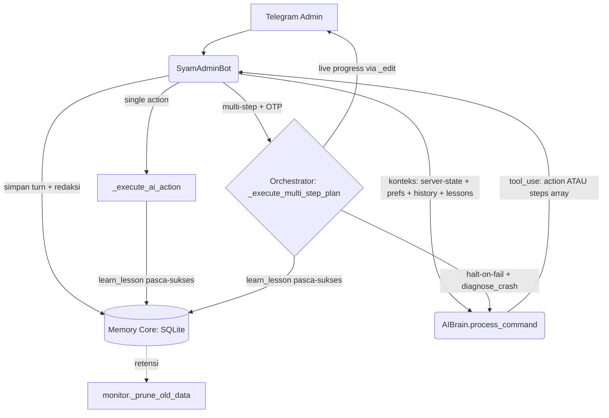

# Rencana Implementasi (Revisi): Memory Core + AI Task Orchestrator — SyamAdmin v3.1

> ✅ **STATUS: TERIMPLEMENTASI.** Seluruh fase (1–4) di dokumen ini sudah dikoding & diuji:
> Memory Core (Pilar 2-4) di `brain.py`, multi-step orchestrator + gating OTP di `telegram_bot.py`,
> retensi memori di `monitor.py`, redaksi rahasia, dan unit test di `tests/`. Dokumen tetap
> dipertahankan sebagai spesifikasi desain. Arsitektur mutakhir terangkum di [CLAUDE.md](CLAUDE.md).

> **Status revisi.** Dokumen ini menggantikan rencana v3.0. Versi sebelumnya ditulis terhadap
> arsitektur lama (JSON-in-text) dan memuat beberapa klaim caching yang tidak berlaku di model
> default. Versi ini disinkronkan dengan kondisi kode aktual dan mengoreksi asumsi tersebut.

Tujuan: mengubah `SyamAdmin` dari agen **stateless & single-action** menjadi agen yang punya
**memori** (mengenal preferensi admin, konteks percakapan, dan pelajaran insiden) serta mampu
**mengeksekusi rencana multi-langkah** dengan aman, transparan, dan hemat — **tanpa menambah
infrastruktur baru** (tetap SQLite + Anthropic).

---

## 0. Fondasi yang SUDAH ADA (jangan dibangun ulang)

Perubahan sesi-sesi sebelumnya sudah menyiapkan landasan; rencana ini menumpang di atasnya:

| Fondasi | Lokasi | Dipakai oleh rencana ini |
|---|---|---|
| **Native tool-use** (`DISPATCH_TOOL`) | [brain.py](file:///Users/syams/PROJECTS/SyamAdmin/modules/brain.py) | Planner multi-step = perluasan schema tool, **bukan** JSON teks |
| **Pilar 1 (server context)** via `get_state_context()` + `collect_metrics()` | [monitor.py](file:///Users/syams/PROJECTS/SyamAdmin/modules/monitor.py), diinjeksi di [telegram_bot.py:534-535](file:///Users/syams/PROJECTS/SyamAdmin/modules/telegram_bot.py) | Sudah jalan — tinggal dipakai |
| **Pola `_ensure_db()` per-modul** | executor, brain, monitor, site_manager | `brain._ensure_db()` tinggal diperluas |
| **Retention engine** `_prune_old_data()` | [monitor.py](file:///Users/syams/PROJECTS/SyamAdmin/modules/monitor.py) | Daftarkan tabel memory ke sini |
| **Prompt caching prefix statis** | `process_command` | Sudah ada (lihat §2) |
| **Gerbang OTP destruktif** (`forced_otp`, `destructive`, `DESTRUCTIVE_ACTIONS`) | [telegram_bot.py](file:///Users/syams/PROJECTS/SyamAdmin/modules/telegram_bot.py) | Gating seluruh plan |
| **Kirim pesan aman Markdown** (`_reply`/`_edit`) | [telegram_bot.py](file:///Users/syams/PROJECTS/SyamAdmin/modules/telegram_bot.py) | Live progress tracker wajib lewat `_edit` |

---

## 1. Arsitektur Terintegrasi



---

## 2. Manajemen Memori (4 Pilar, SQLite)

### Pilar 1 — Server Context (real-time) — *SUDAH ADA*
Tetap memakai `monitor.get_state_context()` (status LEMP, daftar site) + `collect_metrics()`
(CPU/RAM/Disk). **Tidak diduplikasi** di brain — brain menerimanya sebagai argumen `context`.

### Pilar 2 — User Memory (`user_memory`)
Preferensi admin yang persisten (versi PHP, timezone, framework favorit, dll).
```sql
CREATE TABLE IF NOT EXISTS user_memory (
    key TEXT PRIMARY KEY,
    value TEXT NOT NULL,
    updated_at DATETIME DEFAULT CURRENT_TIMESTAMP
);
```
API di `AIBrain`: `store_user_preference(key, value)`, `get_user_preferences() -> dict`.
Injeksi: hanya ringkasan singkat prefs ke `context` (mis. `"Pref: php=8.3, tz=Asia/Makassar"`).

### Pilar 3 — Short-Term / Chat History (`chat_history`)
Riwayat percakapan dengan **sliding window** (maks. 8 turn dikirim ke API).
```sql
CREATE TABLE IF NOT EXISTS chat_history (
    id INTEGER PRIMARY KEY AUTOINCREMENT,
    timestamp DATETIME DEFAULT CURRENT_TIMESTAMP,
    role TEXT NOT NULL,          -- 'user' | 'assistant'
    content TEXT NOT NULL
);
```
**Keputusan desain penting:**
- Simpan **teks turn yang disederhanakan**, BUKAN blok `tool_use`/`tool_result` mentah —
  agar saat dikirim ulang ke API tidak merusak pasangan tool-call (yang wajib lengkap).
- **Redaksi rahasia sebelum persist** (lihat §4) — wajib, karena wizard menghasilkan password DB.
- Dikirim ke API sebagai **message turns** (`[{role, content}, ...]`), bukan satu blob teks.
- Window API ≠ retensi DB; lihat §5.

API: `add_to_chat_history(role, content)`, `get_recent_history(limit=8) -> list[dict]`.

### Pilar 4 — Long-Term Memory (`long_term_memory`)
Ringkasan insiden & perubahan konfigurasi penting, dengan **pencarian relevan FTS5**
(bukan `LIKE` — FTS5 nol-infra, jauh lebih relevan, tetap ringan di VPS).
```sql
CREATE TABLE IF NOT EXISTS long_term_memory (
    id INTEGER PRIMARY KEY AUTOINCREMENT,
    timestamp DATETIME DEFAULT CURRENT_TIMESTAMP,
    category TEXT NOT NULL,      -- 'incident' | 'config_change'
    summary TEXT NOT NULL
);
CREATE VIRTUAL TABLE IF NOT EXISTS long_term_fts
    USING fts5(summary, content='long_term_memory', content_rowid='id');
-- + trigger sinkronisasi INSERT (atau rebuild berkala bila trigger dihindari)
```
API: `learn_lesson(category, summary)` (dipanggil **hanya** setelah aksi/plan sukses),
`query_long_term_memory(text, top_n=3) -> list[str]` (dibatasi top-3 & ringkas agar konteks tak membengkak).

---

## 3. Prompt Caching — Fakta Terukur & Kebijakan

**Hasil pengukuran live (sesi ini):** prefix `system`+`tools` = **1470 token**.

| Model | Min. cacheable | Status caching pada prefix 1470 |
|---|---|---|
| **Haiku 4.5** (default `/ai`) | 2048 token | ❌ **tidak aktif** (1470 < 2048) |
| **Sonnet 4.6 / Opus** | 1024 token | ✅ aktif (terverifikasi `cache_read=1147`) |

**Kebijakan (mengoreksi v3.0):**
1. **Cache HANYA prefix statis** (system + tools) — sudah diterapkan di `process_command`.
2. **JANGAN cache chat history / prefs** (konten volatil) — itu anti-pattern yang justru
   membatalkan cache-hit. Konten dinamis masuk blok `messages` (tidak di-cache).
3. Caching baru **menghasilkan diskon** bila router `/ai` memakai **Sonnet/Opus** (set
   `CLAUDE_MODEL`). Di Haiku, penanda cache bersifat aman-tanpa-efek (future-proof).
4. **Kesadaran biaya:** menyuntik memory menaikkan input token. Pilih sikap eksplisit:
   (a) tetap Haiku (token murah, tanpa caching), atau (b) Sonnet (caching menutup biaya memory).

---

## 4. Keamanan Memori — Redaksi Rahasia (WAJIB)

Sebelum **apa pun** ditulis ke `chat_history`/`long_term_memory`, jalankan redaksi:
```python
import re
_SECRET_PATTERNS = [
    r"sk-ant-[A-Za-z0-9_\-]+",                 # Anthropic API key
    r"\b\d{6,}:[A-Za-z0-9_\-]{30,}\b",         # Telegram bot token
    r"(?i)(password|passwd|pass|pwd|secret|token|api[_-]?key)\s*[:=]\s*\S+",
    r"\b\d{4}\b(?=.*OTP)",                      # OTP
]
def redact_secrets(text: str) -> str:
    for p in _SECRET_PATTERNS:
        text = re.sub(p, "[REDACTED]", text)
    return text
```
Alasan: `wizard_provision` **men-generate & menampilkan password DB**; tanpa redaksi, kredensial
tersimpan plaintext di SQLite (`/var/lib/syamadmin/syamadmin.db`). File DB tetap `chmod 600`.

---

## 5. Retensi Memori (integrasi ke engine yang ada)

Sliding-window membatasi yang dikirim ke API, **bukan** baris DB. Daftarkan ke
`monitor._prune_old_data()` (atau `brain._prune_memory()` yang dipanggil dari loop monitor):
- `chat_history`: simpan maks. **N hari** (`CHAT_HISTORY_RETENTION_DAYS`, default 14) **atau** maks. 500 baris.
- `long_term_memory`: cap **M baris** (mis. 1000) — buang tertua bila melebihi.
- Tambahkan ke `config.env.example` beserta default-nya.

---

## 6. AI Task Planner & Orchestrator (di atas tool-use)

### 6.1 Perluasan `DISPATCH_TOOL` (bukan tool kedua)
Tambah field opsional `steps` ke `input_schema`. Single-action = `steps` absen/length-1.
```jsonc
"steps": {
  "type": "array",
  "description": "Untuk perintah majemuk: daftar aksi berurutan. Kosongkan untuk aksi tunggal.",
  "items": {
    "type": "object",
    "properties": {
      "module":  {"type": "string", "enum": [...sama dgn enum utama...]},
      "action":  {"type": "string"},
      "params":  {"type": "object", "additionalProperties": true},
      "message": {"type": "string"}
    },
    "required": ["module", "action", "message"]
  }
}
```
`process_command` mengembalikan dict yang sama + (opsional) `steps: [...]`. Bila `steps` ada &
panjang > 1 → bot masuk jalur orchestrator.

### 6.2 Orchestrator `_execute_multi_step_plan(update, plan)`
1. **Antrean:** simpan di `self._pending_plans[admin_id]` (dengan `expires`, seperti `_pending_confirmations`).
2. **Gating OTP terpadu (reuse #3):** bila **ada** step dengan `module.action ∈ DESTRUCTIVE_ACTIONS`
   **atau** `executor.run_command` → set `destructive=True`; **seluruh plan** wajib **satu OTP**
   (kata "ya" ditolak). Manfaatkan `forced_otp`/`destructive` yang sudah ada.
3. **Single-flight:** tolak perintah baru bila ada plan berjalan untuk admin tsb (cegah balapan).
4. **Live progress (via `_edit`):** satu pesan status yang di-*edit* berkala (jangan terlalu sering — hindari throttle Telegram):
   > 🔄 *Autopilot berjalan…*
   > ✅ 1/3 Backup database — selesai
   > ⏳ 2/3 Menghentikan Nginx — berjalan
   > 💤 3/3 Ubah port SSH → 2222 — menunggu
5. **Halt-on-failure + diagnosa:** bila satu step gagal → **hentikan** sisa langkah, panggil
   **`diagnose_crash()`** (bukan `explain_error`) untuk usulan perbaikan, tampilkan, tawarkan
   tindak lanjut **manual** (tombol/`/ai perbaiki <svc>`).
   > ⚠️ **Tidak ada rollback otomatis** — mayoritas operasi sysadmin tak reversibel. "Undo"
   > hanya disediakan bila ada invers jelas (mis. menyalakan ulang service yang tadi dimatikan).
6. **Belajar:** setelah **seluruh** plan sukses → `learn_lesson("config_change", <ringkasan ter-redaksi>)`.

---

## 7. Rencana Perubahan Berkas

### [MODIFY] modules/brain.py
- `_ensure_db()`: tambah `user_memory`, `chat_history`, `long_term_memory` (+FTS5).
- API memori: `store_user_preference`, `get_user_preferences`, `add_to_chat_history`,
  `get_recent_history`, `learn_lesson`, `query_long_term_memory`.
- `redact_secrets()` (helper modul-level) dipakai semua jalur persist.
- `process_command`: terima riwayat sbg message turns; perluas `DISPATCH_TOOL` dgn `steps`;
  kembalikan `steps` bila ada. (Caching prefix statis: **tetap**, jangan cache history.)

### [MODIFY] modules/telegram_bot.py
- `cmd_ai`/`handle_text`: panggil `add_to_chat_history()` untuk input admin & balasan bot
  (setelah redaksi); kirim `get_recent_history()` ke `process_command`.
- `_pending_plans` + `_execute_multi_step_plan()` + single-flight guard.
- Routing: bila `result.get("steps")` panjang>1 → orchestrator; selain itu `_execute_ai_action` (existing).
- Gating OTP plan via mekanisme `destructive` (existing).

### [MODIFY] modules/monitor.py
- `_prune_old_data()`: tambah pemangkasan `chat_history` & cap `long_term_memory`.

### [MODIFY] config.env.example
- `CHAT_HISTORY_RETENTION_DAYS=14`, `LONG_TERM_MEMORY_MAX_ROWS=1000`.

### [MOVE] tests
- Pindahkan tes dari `scratch/` (gitignored) ke `tests/` agar ter-deploy/CI.

---

## 8. Fasing (risiko menaik — kerjakan berurutan, verifikasi tiap fase)

| Fase | Isi | Kenapa duluan |
|---|---|---|
| **1** | **Multi-step orchestrator** (perluas tool + `_execute_multi_step_plan` + gating OTP + live progress) | Nilai tertinggi; fondasi (#2/#3/#6) sudah siap; tak butuh skema DB baru |
| **2** | `user_memory` | Sederhana, risiko rendah, dampak UX nyata |
| **3** | `chat_history` + **redaksi** + retensi | Multi-turn; butuh redaksi & pruning |
| **4** | `long_term_memory` (FTS5 + `learn_lesson` pasca-sukses) | Paling kompleks; bergantung fase 1-3 |

---

## 9. Rencana Verifikasi

1. **Memori (unit, di `tests/`):**
   - `chat_history`: sliding window benar (maks 8 ke API), retensi DB memangkas baris lama.
   - `redact_secrets`: token Telegram, `sk-ant-…`, `password=…`, OTP → `[REDACTED]`.
   - `user_memory`: simpan/muat preferensi.
   - `long_term_memory`: FTS5 mengembalikan top-N relevan.
2. **Orchestrator (live, daemon lokal):**
   - Perintah majemuk → `steps` valid (verifikasi via tool-use, seperti pola tes #2 sesi ini).
   - Plan dgn step destruktif → **wajib OTP**, "ya" ditolak; live progress ter-update; halt-on-fail
     memicu `diagnose_crash`.
3. **Caching:** konfirmasi `cache_read>0` saat router = Sonnet; inert (tanpa error) di Haiku.

---

*Revisi ini menyatukan memori berlapis, eksekusi multi-langkah yang aman (OTP + halt + diagnosa),
caching yang jujur sesuai model, dan redaksi rahasia — semuanya selaras dengan arsitektur kode aktual.*
